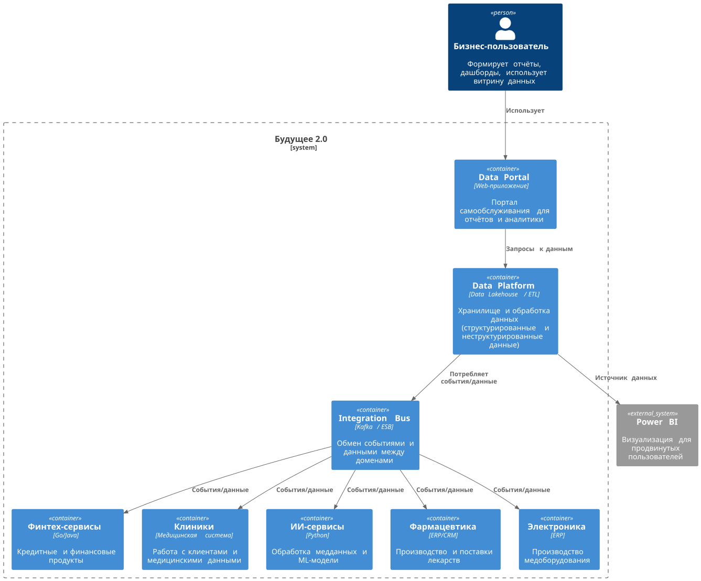

## Table of content
- [C4 container diagra](#c4-container-diagram)
- [Проблемные места](#проблемные-места)
- [Приоритизация проблем](#приоритизация-проблем)

## C4 container diagram


<details>
<summary>plantuml</summary>

```plantuml
@startuml
!include https://raw.githubusercontent.com/plantuml-stdlib/C4-PlantUML/master/C4_Container.puml

LAYOUT_TOP_DOWN()

Person(bizUser, "Бизнес-пользователь", "Формирует отчёты, дашборды, использует витрину данных")

System_Boundary(future20, "Будущее 2.0") {

  Container(dataPortal, "Data Portal", "Web-приложение", "Портал самообслуживания для отчётов и аналитики")
  Container(dataPlatform, "Data Platform", "Data Lakehouse / ETL", "Хранилище и обработка данных (структурированные и неструктурированные данные)")
  Container(fintech, "Финтех-сервисы", "Go/Java", "Кредитные и финансовые продукты")
  Container(clinics, "Клиники", "Медицинская система", "Работа с клиентами и медицинскими данными")
  Container(aiServices, "ИИ-сервисы", "Python", "Обработка медданных и ML-модели")
  Container(pharma, "Фармацевтика", "ERP/CRM", "Производство и поставки лекарств")
  Container(electronics, "Электроника", "ERP", "Производство медоборудования")
  Container(messageBus, "Integration Bus", "Kafka / ESB", "Обмен событиями и данными между доменами")

}

System_Ext(powerBI, "Power BI", "Визуализация для продвинутых пользователей")

Rel(bizUser, dataPortal, "Использует")
Rel(dataPortal, dataPlatform, "Запросы к данным")
Rel(dataPlatform, messageBus, "Потребляет события/данные")
Rel(messageBus, fintech, "События/данные")
Rel(messageBus, clinics, "События/данные")
Rel(messageBus, aiServices, "События/данные")
Rel(messageBus, pharma, "События/данные")
Rel(messageBus, electronics, "События/данные")
Rel(dataPlatform, powerBI, "Источник данных")

@enduml
```
</details>


## Проблемные места

### Устаревший DWH

- MS SQL Server 2008 — не тянет сотни терабайт.
- Логика жёстко зашита внутрь, менять что-то дорого и долго.
- Массовые кастомизации под BI ломают производительность.

### Слабая масштабируемость

- Один монолит DWH на все направления бизнеса.
- Новые компании (фарма, электроника) нельзя подключить без переписывания логики.

### Медленные отчёты

- Сложные отчёты считаются часами.
- Пользователи ждут, бизнесу недоступна быстрая аналитика.

### Легаси-инструменты

- Power Builder — мёртвый продукт, держит старые интерфейсы.

- Apache Camel устарел для роли шины, плохо масштабируется под события.

### Нет самообслуживания

- Отчёты делает только BI-команда.

- Бизнес-пользователи зависят от IT, нет гибкости в анализе.

### Хаос в интеграциях

- Старые точки интеграции (DWH как центр всего).
- Нет прозрачного управления потоками данных.

### Разнородный стек технологий

- ИИ на Python, финтех на Go/Java, старый DWH — всё живёт разрозненно.
- Нет единой платформы данных.

### Приоритизация проблем

### Must (обязательно решать)

- Устаревший DWH — без замены/расщепления бизнес не сможет масштабироваться.
- Слабая масштабируемость — подключение новых компаний без переделки невозможно.
- Медленные отчёты — бизнесу критично получать аналитику быстро.

### Should (желательно решить)

- Нет самообслуживания — витрина нужна для разгрузки BI и повышения скорости работы.
- Хаос в интеграциях — переход на современную шину/стриминг даст прозрачность и управляемость.

### Could (можно решить позже)

- Разнородный стек технологий — можно временно оставить, главное — унифицировать данные через платформу.

### Won’t (сейчас не трогаем)

- Легаси-инструменты (Power Builder, Camel) — пусть живут локально в доменах, пока не появится время и бюджет на полный отказ.