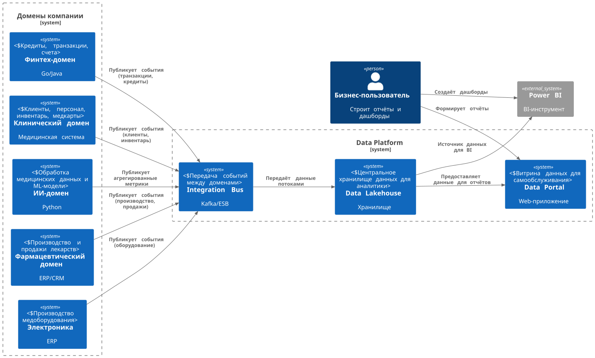

## Table of content
- [Разделение на домены](#разделение-на-домены)
- [Data Flow Diagram](#data-flow-diagram)
- [Обоснование разделения на домены](#обоснование-разделения-на-домены)

## Разделение на домены
- Финтех-домен (Кредиты, счета, транзакции, фин. история)
- Клинический домен (Клиентские данные, записи приёмов, инвентаризация, персонал. Медицинские карты и исследования остаются в этом домене, но не уходят в витрину.)
- ИИ-домен
- ML/AI сервисы для обработки медданных (Сюда приходят данные от клиник, но наружу в витрину уходят только агрегаты/метрики)
- Фармацевтический домен
- Производство и продажи лекарств.
- Электроника
- Производство медоборудования.
- Data Platform (центральный домен)
- Data Lakehouse + ETL/Stream processing.
- Интеграция событий через Kafka/шину.
- Витрина данных (Data Portal).

## Data Flow Diagram




<details>
<summary>plantuml</summary>

```plantuml
@startuml
!include https://raw.githubusercontent.com/plantuml-stdlib/C4-PlantUML/master/C4_Context.puml

LAYOUT_LEFT_RIGHT()

Person(bizUser, "Бизнес-пользователь", "Строит отчёты и дашборды")

System_Boundary(domains, "Домены компании") {
    System(fintech, "Финтех-домен", "Go/Java", "Кредиты, транзакции, счета")
    System(clinics, "Клинический домен", "Медицинская система", "Клиенты, персонал, инвентарь, медкарты")
    System(ai, "ИИ-домен", "Python", "Обработка медицинских данных и ML-модели")
    System(pharma, "Фармацевтический домен", "ERP/CRM", "Производство и продажи лекарств")
    System(electronics, "Электроника", "ERP", "Производство медоборудования")
}

System_Boundary(dataplatform, "Data Platform") {
    System(kafka, "Integration Bus", "Kafka/ESB", "Передача событий между доменами")
    System(lakehouse, "Data Lakehouse", "Хранилище", "Центральное хранилище данных для аналитики")
    System(dataPortal, "Data Portal", "Web-приложение", "Витрина данных для самообслуживания")
}

System_Ext(powerBI, "Power BI", "BI-инструмент")

' Потоки
Rel(fintech, kafka, "Публикует события (транзакции, кредиты)")
Rel(clinics, kafka, "Публикует события (клиенты, инвентарь)")
Rel(ai, kafka, "Публикует агрегированные метрики")
Rel(pharma, kafka, "Публикует события (производство, продажи)")
Rel(electronics, kafka, "Публикует события (оборудование)")

Rel(kafka, lakehouse, "Передаёт данные потоками")
Rel(lakehouse, dataPortal, "Предоставляет данные для отчётов")
Rel(lakehouse, powerBI, "Источник данных для BI")

Rel(bizUser, dataPortal, "Формирует отчёты")
Rel(bizUser, powerBI, "Создаёт дашборды")

@enduml

```
</details>


## Обоснование разделения на домены

- Убираем монолитный DWH. Каждая компания/подразделение хранит и обслуживает свои данные.
- Домены независимы. Можно развивать финтех или фарму без вмешательства в клиники или ИИ.
- Data Platform — единая точка аналитики. Бизнес получает целостную картину без необходимости тянуть данные напрямую из доменов.
- Масштабируемость. Легко добавлять новые компании, просто подключая их к шине.
- Гибкость. Бизнес-пользователь может строить отчёты сам, без BI-разработчиков.