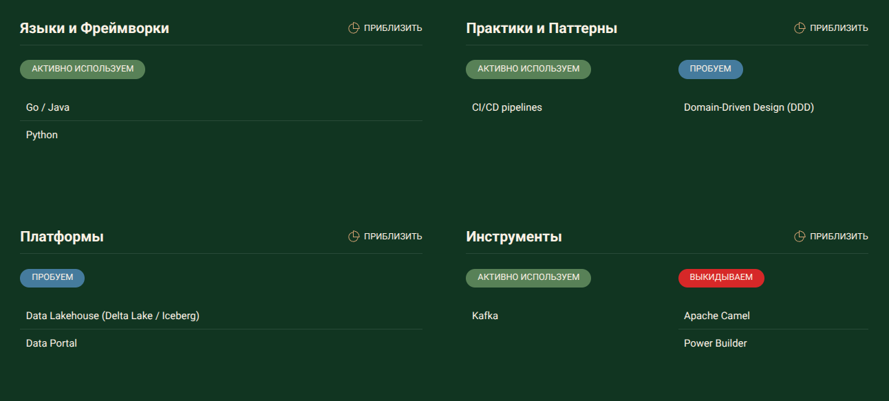
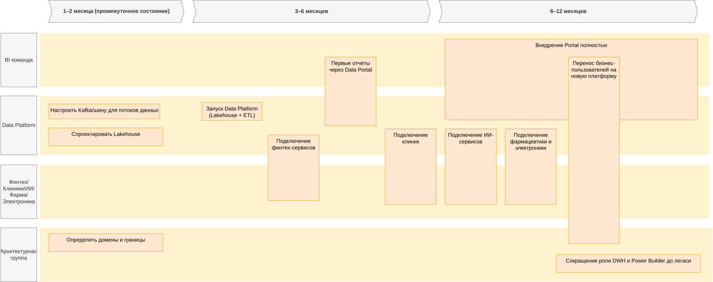

## Table of content
- [Технический радар](#технический-радар)
- [Роадмап](#роадмап)
- [Обоснование роадмапа](#обоснование-роадмапа)


## Технический радар


более подробно в папке tech_radar (можно запустить aoe tech_radar).


## Роадмап




<details>
<summary>drawio xml</summary>

```xml
<?xml version="1.0" encoding="UTF-8"?>
<mxfile host="app.diagrams.net" agent="Mozilla/5.0 (X11; Linux x86_64) AppleWebKit/537.36 (KHTML, like Gecko) Chrome/138.0.0.0 Safari/537.36" version="28.1.0">
  <diagram id="1zcTAVt1k4KSup7FvAfL" name="Roadmap">
    <mxGraphModel dx="5888" dy="3552" grid="1" gridSize="10" guides="1" tooltips="1" connect="1" arrows="1" fold="1" page="1" pageScale="1" pageWidth="3300" pageHeight="2339" math="0" shadow="0">
      <root>
        <mxCell id="3D7FDG2aXA9G618_Kong-0" />
        <mxCell id="3D7FDG2aXA9G618_Kong-1" parent="3D7FDG2aXA9G618_Kong-0" />
        <mxCell id="f_Z0fl4RA_nw16EVSeFZ-0" value="&lt;h4 data-end=&quot;560&quot; data-start=&quot;531&quot;&gt;&lt;strong data-end=&quot;560&quot; data-start=&quot;536&quot;&gt;3–6 месяцев&lt;/strong&gt;&lt;/h4&gt;" style="shape=step;perimeter=stepPerimeter;whiteSpace=wrap;html=1;fixedSize=1;size=10;fillColor=#f5f5f5;strokeColor=#666666;fontSize=18;fontStyle=1;align=center;rounded=0;fontColor=#333333;" vertex="1" parent="3D7FDG2aXA9G618_Kong-1">
          <mxGeometry x="-1990" y="-1260" width="790" height="74.4" as="geometry" />
        </mxCell>
        <mxCell id="wGroBH12Sy7-OgBsN0fJ-2" value="" style="shape=rect;fillColor=#fff2cc;strokeColor=none;fontSize=24;html=1;whiteSpace=wrap;align=left;verticalAlign=top;spacing=5;rounded=0;" parent="3D7FDG2aXA9G618_Kong-1" vertex="1">
          <mxGeometry x="-2500" y="-1150" width="2230" height="180" as="geometry" />
        </mxCell>
        <mxCell id="wGroBH12Sy7-OgBsN0fJ-4" value="" style="shape=rect;fillColor=#fff2cc;strokeColor=none;fontSize=24;html=1;whiteSpace=wrap;align=left;verticalAlign=top;spacing=5;rounded=0;" parent="3D7FDG2aXA9G618_Kong-1" vertex="1">
          <mxGeometry x="-2500" y="-940" width="2230" height="196.8" as="geometry" />
        </mxCell>
        <mxCell id="wGroBH12Sy7-OgBsN0fJ-5" value="Настроить Kafka/шину для потоков данных" style="shape=rect;fillColor=#ffe6cc;strokeColor=#d79b00;fontSize=18;html=1;whiteSpace=wrap;align=left;verticalAlign=top;spacing=5;rounded=0;" parent="3D7FDG2aXA9G618_Kong-1" vertex="1">
          <mxGeometry x="-2470" y="-913.2" width="370" height="50" as="geometry" />
        </mxCell>
        <mxCell id="wGroBH12Sy7-OgBsN0fJ-6" value="Спроектировать Lakehouse" style="shape=rect;fillColor=#ffe6cc;strokeColor=#d79b00;fontSize=18;html=1;whiteSpace=wrap;align=center;verticalAlign=top;spacing=5;rounded=0;" parent="3D7FDG2aXA9G618_Kong-1" vertex="1">
          <mxGeometry x="-2470" y="-833.2" width="380" height="60" as="geometry" />
        </mxCell>
        <mxCell id="wGroBH12Sy7-OgBsN0fJ-7" value="Data Platform" style="rounded=0;whiteSpace=wrap;html=1;fillColor=#f5f5f5;fontColor=#333333;strokeColor=#666666;fontSize=18;" parent="3D7FDG2aXA9G618_Kong-1" vertex="1">
          <mxGeometry x="-2630" y="-940" width="120" height="196.8" as="geometry" />
        </mxCell>
        <mxCell id="wGroBH12Sy7-OgBsN0fJ-8" value="BI команда" style="rounded=0;whiteSpace=wrap;html=1;fillColor=#f5f5f5;fontColor=#333333;strokeColor=#666666;fontSize=18;" parent="3D7FDG2aXA9G618_Kong-1" vertex="1">
          <mxGeometry x="-2630" y="-1150" width="120" height="180" as="geometry" />
        </mxCell>
        <mxCell id="wGroBH12Sy7-OgBsN0fJ-9" value="1–2 месяца (промежуточное состояние)" style="shape=step;perimeter=stepPerimeter;whiteSpace=wrap;html=1;fixedSize=1;size=10;fillColor=#f5f5f5;strokeColor=#666666;fontSize=18;fontStyle=1;align=center;rounded=0;fontColor=#333333;" parent="3D7FDG2aXA9G618_Kong-1" vertex="1">
          <mxGeometry x="-2470" y="-1260" width="450" height="74.4" as="geometry" />
        </mxCell>
        <mxCell id="wGroBH12Sy7-OgBsN0fJ-11" value="Запуск Data Platform (Lakehouse + ETL)" style="shape=rect;fillColor=#ffe6cc;strokeColor=#d79b00;fontSize=18;html=1;whiteSpace=wrap;align=center;verticalAlign=top;spacing=5;rounded=0;" parent="3D7FDG2aXA9G618_Kong-1" vertex="1">
          <mxGeometry x="-1960" y="-918.2" width="200" height="60" as="geometry" />
        </mxCell>
        <mxCell id="f_Z0fl4RA_nw16EVSeFZ-2" value="&lt;h4 data-end=&quot;560&quot; data-start=&quot;531&quot;&gt;&lt;strong data-end=&quot;560&quot; data-start=&quot;536&quot;&gt;6–12 месяцев&lt;/strong&gt;&lt;/h4&gt;" style="shape=step;perimeter=stepPerimeter;whiteSpace=wrap;html=1;fixedSize=1;size=10;fillColor=#f5f5f5;strokeColor=#666666;fontSize=18;fontStyle=1;align=center;rounded=0;fontColor=#333333;" vertex="1" parent="3D7FDG2aXA9G618_Kong-1">
          <mxGeometry x="-1170" y="-1260" width="860" height="74.4" as="geometry" />
        </mxCell>
        <mxCell id="f_Z0fl4RA_nw16EVSeFZ-3" value="" style="shape=rect;fillColor=#fff2cc;strokeColor=none;fontSize=24;html=1;whiteSpace=wrap;align=left;verticalAlign=top;spacing=5;rounded=0;" vertex="1" parent="3D7FDG2aXA9G618_Kong-1">
          <mxGeometry x="-2500" y="-500" width="2240" height="180" as="geometry" />
        </mxCell>
        <mxCell id="f_Z0fl4RA_nw16EVSeFZ-4" value="Архитектурная группа" style="rounded=0;whiteSpace=wrap;html=1;fillColor=#f5f5f5;fontColor=#333333;strokeColor=#666666;fontSize=18;" vertex="1" parent="3D7FDG2aXA9G618_Kong-1">
          <mxGeometry x="-2630" y="-500" width="120" height="180" as="geometry" />
        </mxCell>
        <mxCell id="f_Z0fl4RA_nw16EVSeFZ-6" value="Определить домены и границы" style="shape=rect;fillColor=#ffe6cc;strokeColor=#d79b00;fontSize=18;html=1;whiteSpace=wrap;align=center;verticalAlign=top;spacing=5;rounded=0;" vertex="1" parent="3D7FDG2aXA9G618_Kong-1">
          <mxGeometry x="-2470" y="-480" width="380" height="60" as="geometry" />
        </mxCell>
        <mxCell id="f_Z0fl4RA_nw16EVSeFZ-7" value="" style="shape=rect;fillColor=#fff2cc;strokeColor=none;fontSize=24;html=1;whiteSpace=wrap;align=left;verticalAlign=top;spacing=5;rounded=0;" vertex="1" parent="3D7FDG2aXA9G618_Kong-1">
          <mxGeometry x="-2500" y="-710" width="2230" height="180" as="geometry" />
        </mxCell>
        <mxCell id="f_Z0fl4RA_nw16EVSeFZ-8" value="Финтех/Клиники/ИИ/Фарма/Электроника" style="rounded=0;whiteSpace=wrap;html=1;fillColor=#f5f5f5;fontColor=#333333;strokeColor=#666666;fontSize=18;" vertex="1" parent="3D7FDG2aXA9G618_Kong-1">
          <mxGeometry x="-2630" y="-710" width="120" height="180" as="geometry" />
        </mxCell>
        <mxCell id="f_Z0fl4RA_nw16EVSeFZ-11" value="Подключение финтех-сервисов " style="shape=rect;fillColor=#ffe6cc;strokeColor=#d79b00;fontSize=18;html=1;whiteSpace=wrap;align=center;verticalAlign=top;spacing=5;rounded=0;" vertex="1" parent="3D7FDG2aXA9G618_Kong-1">
          <mxGeometry x="-1740" y="-810" width="170" height="220" as="geometry" />
        </mxCell>
        <mxCell id="f_Z0fl4RA_nw16EVSeFZ-12" value="Подключение клиник " style="shape=rect;fillColor=#ffe6cc;strokeColor=#d79b00;fontSize=18;html=1;whiteSpace=wrap;align=center;verticalAlign=top;spacing=5;rounded=0;" vertex="1" parent="3D7FDG2aXA9G618_Kong-1">
          <mxGeometry x="-1350" y="-830" width="170" height="253.2" as="geometry" />
        </mxCell>
        <mxCell id="f_Z0fl4RA_nw16EVSeFZ-13" value="Первые отчёты через Data Portal" style="shape=rect;fillColor=#ffe6cc;strokeColor=#d79b00;fontSize=18;html=1;whiteSpace=wrap;align=center;verticalAlign=top;spacing=5;rounded=0;" vertex="1" parent="3D7FDG2aXA9G618_Kong-1">
          <mxGeometry x="-1550" y="-1070" width="170" height="230" as="geometry" />
        </mxCell>
        <mxCell id="f_Z0fl4RA_nw16EVSeFZ-17" value="Подключение ИИ-сервисов " style="shape=rect;fillColor=#ffe6cc;strokeColor=#d79b00;fontSize=18;html=1;whiteSpace=wrap;align=center;verticalAlign=top;spacing=5;rounded=0;" vertex="1" parent="3D7FDG2aXA9G618_Kong-1">
          <mxGeometry x="-1150" y="-830" width="170" height="253.2" as="geometry" />
        </mxCell>
        <mxCell id="f_Z0fl4RA_nw16EVSeFZ-18" value="Подключение фармацевтики и электроники " style="shape=rect;fillColor=#ffe6cc;strokeColor=#d79b00;fontSize=18;html=1;whiteSpace=wrap;align=center;verticalAlign=top;spacing=5;rounded=0;" vertex="1" parent="3D7FDG2aXA9G618_Kong-1">
          <mxGeometry x="-950" y="-830" width="170" height="253.2" as="geometry" />
        </mxCell>
        <mxCell id="f_Z0fl4RA_nw16EVSeFZ-19" value="Внедрение Portal полностью" style="shape=rect;fillColor=#ffe6cc;strokeColor=#d79b00;fontSize=18;html=1;whiteSpace=wrap;align=center;verticalAlign=top;spacing=5;rounded=0;" vertex="1" parent="3D7FDG2aXA9G618_Kong-1">
          <mxGeometry x="-1150" y="-1130" width="840" height="270" as="geometry" />
        </mxCell>
        <mxCell id="f_Z0fl4RA_nw16EVSeFZ-20" value="Сокращение роли DWH и Power Builder до легаси" style="shape=rect;fillColor=#ffe6cc;strokeColor=#d79b00;fontSize=18;html=1;whiteSpace=wrap;align=center;verticalAlign=top;spacing=5;rounded=0;" vertex="1" parent="3D7FDG2aXA9G618_Kong-1">
          <mxGeometry x="-780" y="-410" width="480" height="60" as="geometry" />
        </mxCell>
        <mxCell id="f_Z0fl4RA_nw16EVSeFZ-21" value="Перенос бизнес-пользователей на новую платформу " style="shape=rect;fillColor=#ffe6cc;strokeColor=#d79b00;fontSize=18;html=1;whiteSpace=wrap;align=center;verticalAlign=top;spacing=5;rounded=0;" vertex="1" parent="3D7FDG2aXA9G618_Kong-1">
          <mxGeometry x="-740" y="-1070" width="170" height="623.2" as="geometry" />
        </mxCell>
      </root>
    </mxGraphModel>
  </diagram>
</mxfile>
```
</details>


## Обоснование роадмапа

### 1–2 месяца (промежуточное состояние)
На старте нужно зафиксировать архитектурные границы, чтобы не получилось хаоса в интеграциях. Kafka — обязательный элемент для потоковой передачи данных в реальном времени. Lakehouse проектируется заранее, чтобы избежать костылей с параллельными хранилищами. Этот этап даёт базу для следующих шагов.

### 2 — 3–6 месяцев
Нужна рабочая инфраструктура (ETL + Lakehouse), иначе данные не будут собираться централизованно. Финтех и клиники — это ключевые источники данных, без них аналитику строить бессмысленно. Первые отчёты нужны, чтобы показать бизнесу ценность новой платформы и получить buy-in.


### 3 — 6–12 месяцев
ИИ и фарма/электроника дают стратегические данные, которые напрямую связаны с продуктами компании и конкурентными преимуществами. Data Portal снижает нагрузку на IT и делает аналитику доступной бизнесу напрямую. Массовый перенос пользователей нужен, чтобы исключить дублирование платформ и снизить операционные расходы. Постепенный отказ от DWH/Power Builder — логичное завершение, чтобы избавиться от технического долга и legacy-зависимости.